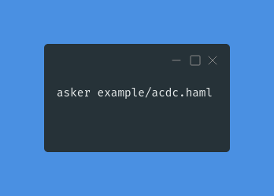
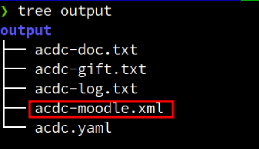
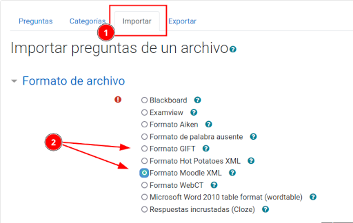

# 7. ¿Cómo funciona?

```
¿Cómo hacemos funcionar Asker?
```

1. Abrimos un terminal y
2. ejecutamos el comando **asker**: `asker PATH/TO/INPUT/FILE`



# 8. Ficheros de salida

```
¿Y los resultados? La salida se guarda en la carpeta "output".
```



# 9. Importar preguntas

```
El fichero de salida `moodle.xml` se importa en Moodle.
```



# 10. Inputs

```
Los "inputs" son las entradas que necesita Asker para trabajar.
```

* Fichero de texto.
* Una especie de _"Mapa conceptual" sin enlaces explícitos_.
* Formato de entrada HAML y/o XML.


> El profesor domina su materia y tiene en su mente el mapa conceptual.

# 11. Asker en acción

```
Veamos un ejemplo de Asker en acción... min = [11, 12, 13, 14]
```


