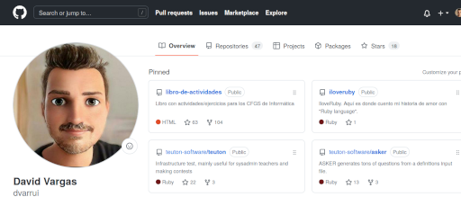
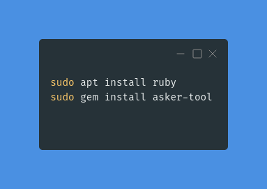

# Asker

_Tu generador de preguntas para Moodle_


| Repo | URL |
| ---- | --- |
| Rubygems | https://rubygems.org/gems/asker-tool/ |
| Repositorio | https://github/teuton-software/asker |

# 1. Agradecimientos

* Organización Ujilliurex
* Baltasar Ortega Bort
    * Fundador de KDE blog (https://www.kdeblog.com/author/balta)
    * Profesor de ciencias en Secundaria.
    * Twitter: @baltolkien
* Comunidad Asker:
    * Telegram: https://t.me/+FsuphhJSaaGVpKcv)
* Teuton Software


# 2. Presentación

* David Vargas Ruiz
* Ingeniero Informático por la ULPGC
* Profesor FP de Sistemas (IES Puerto de la Cruz).
* Ruby, software libre y StarWars.



# 3. El problema

* Como profesor siempre tenemos **poco tiempo**.
* Corregir es aburrido, pero el **feedback** es muy importante.
* Buscar formas/herramientas para **automatizar tareas**.
* Moodle nos ayuda mucho.
* Los cuestionarios de Moodle se corrigen solos pero... las preguntas hay que crearlas.


# 4. Buscando la felicidad del profesorado

Centrando en foco en el _profesorado_.

```
  Si lo profesores están felices...
  Serán más productivos y como resultado...
  Los alumnos aprenderán mejor.
```

Pero... _¿cómo hacemos para crear las preguntas de forma fácil?_

# 5. ¿Qué es Asker?

* Es un generador de preguntas que luego se pueden importar fácilmente en **Moodle** (Formatos XML y Gift).
* Software libre multiplataforma
* Desarrollado en Ruby (Sencillo y rápido).


# 6. Instalación

En dos pasos lo tenemos:
1. Instalación de Ruby: `sudo apt install ruby` (_MacOS y OpenSUSE se pueden saltar este punto_)
2. Instalación de la gema: `sudo gem install asker-tool`.


