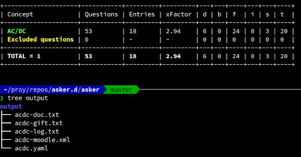

# 7. ¿Cómo funciona?

* Abrimos un terminal y ejecutamos `asker PATH/TO/INPUT/FILE`

# 8. Ficheros de salida

* La salida se guarda en `output`.
* El fichero `moodle.xml` se importa en Moodle.

# 9. Inputs

_¿Qué son los inputs?_

_¿Cómo sabe Asker sobre lo que tiene que trabajar?_

Los **inputs** son las entradas que necesita Asker.
* Fichero de texto.
* Mapa conceptual sin enlaces explícitos.

* El profesor domina su materia y tiene en su mente el mapa conceptual.

# 9. Ejemplos de inputs

* Ejemplos: https://github.com/teuton-software/asker/tree/master/docs/examples
* Inputs reales: https://github.com/dvarrui/asker-inputs

# 10. Cómo aprender más sobre Asker

URLs:
* Rubygems: https://rubygems/gems/asker-tool
* GitHub: https://github.com/teuton-software/asker

Documentation with
* Tutorials and videos

More help
* Regular Jitsi ONLINE events
* Telegram Chat
* email: `teuton.software@protonmail.com`

# 11. Creando un input

Creating a basic asker input.
* Create plain HAML file
* Context
* Concept: names
* Concept: tags
* Concept: defs

**Improving inputs**
* Concept: tables and rows
* Concept: def with files
* More HAML files into the same folder

# 19. Ideas para el futuro

* Entorno gráfico.
* Mejorar "code": entrada de código.
* Incluir "problem": definiciones de problemas.

# 20. Muchas gracias!

* GitHub: @teuton-software
* Email: `teuton-software@protonmail.com`

