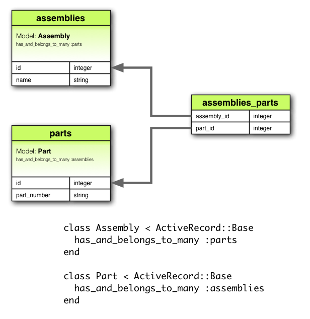
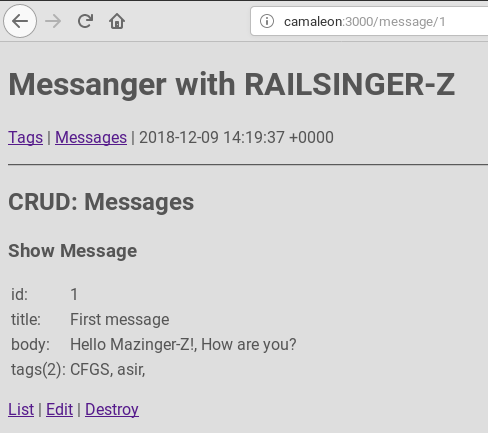

# RAILSINGER-Z


[Volver](README.md)

# Teoría sobre la asociación _has-and-belongs-to-many_

> Enlaces de interés:
> * [Association basics](https://guides.rubyonrails.org/v2.3.11/association_basics.html)
> * [Active Record Migrations](https://guides.rubyonrails.org/active_record_migrations.html)


La asociación _has_and_belongs_to_many_ crea una relación muchos a muchos.

Por ejemplo, un montaje tiene muchas piezas y cada pieza puede estar en muchos montajes. Hace falta una tercera tabla para almacenar esta relación.

```
class Assembly < ActiveRecord::Base
  has_and_belongs_to_many :parts
end

class Part < ActiveRecord::Base
  has_and_belongs_to_many :assemblies
end
```



La migración tendría este aspecto:
```
class CreateAssembliesAndParts < ActiveRecord::Migration[5.0]
  def change
    create_table :assemblies do |t|
      t.string :name
      t.timestamps
    end

    create_table :parts do |t|
      t.string :part_number
      t.timestamps
    end

    create_table :assemblies_parts, id: false do |t|
      t.belongs_to :assembly, index: true
      t.belongs_to :part, index: true
    end
  end
end
```
---

# Crear una migración nueva


There is also a generator which will produce join tables if JoinTable is part of the name:

* `rails g migration CreateJoinTableMessageTag message tag`

```
messenger> rails g migration CreateJoinTableMessageTag message tag

Running via Spring preloader in process 5331
      invoke  active_record
      create    db/migrate/20181209135454_create_join_table_message_tag.rb

```

```
messenger> more db/migrate/20181209135454_create_join_table_message_tag.rb

class CreateJoinTableMessageTag < ActiveRecord::Migration[5.2]
  def change
    create_join_table :messages, :tags do |t|
      # t.index [:message_id, :tag_id]
      # t.index [:tag_id, :message_id]
    end
  end
end
```

```
messenger> rails db:migrate

== 20181209135454 CreateJoinTableMessageTag: migrating ================
-- create_join_table(:messages, :tags)
   -> 0.0023s
== 20181209135454 CreateJoinTableMessageTag: migrated (0.0025s) =======
```

---

# Modelos

```
class Message < ApplicationRecord
  validates :title, presence: true
  has_and_belongs_to_many :tags
end
```

```
class Tag < ApplicationRecord
  validates :name, presence: true
  has_and_belongs_to_many :messages
end
```

---

# Comprobamos

```
messenger> rails dbconsole
SQLite version 3.25.2 2018-09-25 19:08:10
Enter ".help" for usage hints.

sqlite> .tables
ar_internal_metadata  
messages_tags         
messages              
schema_migrations   
tags                

sqlite> .schema messages_tags
CREATE TABLE IF NOT EXISTS "messages_tags" (
  "message_id" integer NOT NULL,
  "tag_id" integer NOT NULL);

sqlite> .quit
```

```
messenger> rails console
Running via Spring preloader in process 6100
Loading development environment (Rails 5.2.2)

irb(main):001:0> m1 = Message.find(1)
=> #<Message id: 1, title: "First message", body: "Hello Mazinger-Z!, How are you?", created_at: "2018-12-09 02:05:17", updated_at: "2018-12-09 02:05:17">

irb(main):002:0> m1.tags
=> #<ActiveRecord::Associations::CollectionProxy []>
irb(main):003:0>

irb(main):004:0> t1 = Tag.find(2)
=> #<Tag id: 2, name: "CFGS", created_at: "2018-12-07 05:06:10", updated_at: "2018-12-07 05:06:10">

irb(main):005:0> m1.tags << t1
=> #<ActiveRecord::Associations::CollectionProxy [#<Tag id: 2, name: "CFGS", created_at: "2018-12-07 05:06:10", updated_at: "2018-12-07 05:06:10">]>
irb(main):006:0>

irb(main):006:0> m1.tags[0].name
=> "CFGS"
```

_¡Increible! ¡Me encanta ActiveRecord!_

---

# Show view

```
<%= render 'header' %>

<h3>Show Message</h3>

<table>
  <tr><td>id:</td><td><%= @message.id %></td></tr>
  <tr><td>title:</td><td><%= @message.title %></td></tr>
  <tr><td>body:</td><td><%= @message.body %></td></tr>
  <tr><td>tags(<%= @message.tags.count%>):</td>
      <td>
      <% @message.tags.each do |tag| %>
        <%= tag.name %>,
      <% end %>
      </td>
  </tr>
</table>

<p>
  <%= link_to "List", '/message' %> |
  <%= link_to "Edit", edit_message_path(@message) %> |
  <%= link_to 'Destroy', @message, method: :delete, data: { confirm: 'Are you sure?' } %>
</p>
```



---

Ir a [comandos](99-commands.md) para ver el resumen de órdenes de rails.

[next >>](20-scaffold.md)
