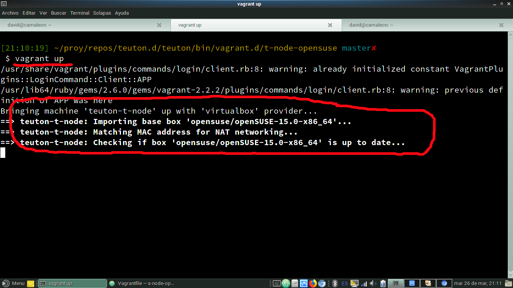
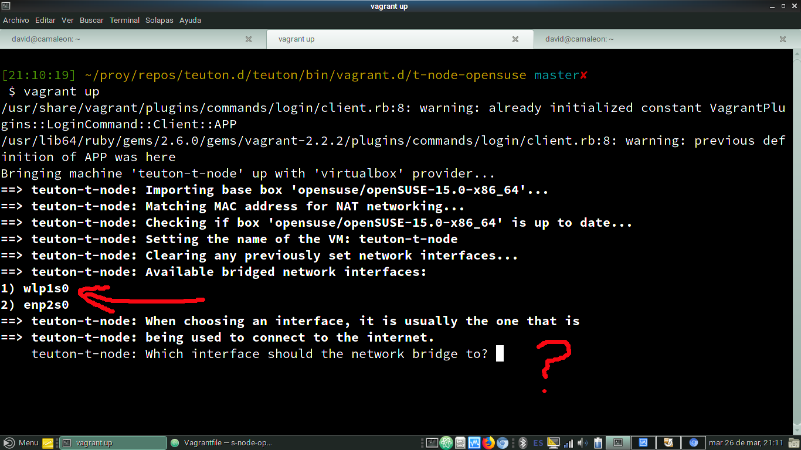
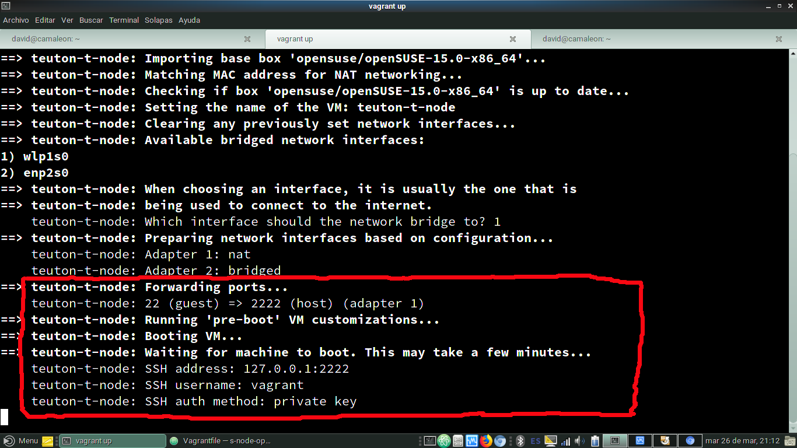
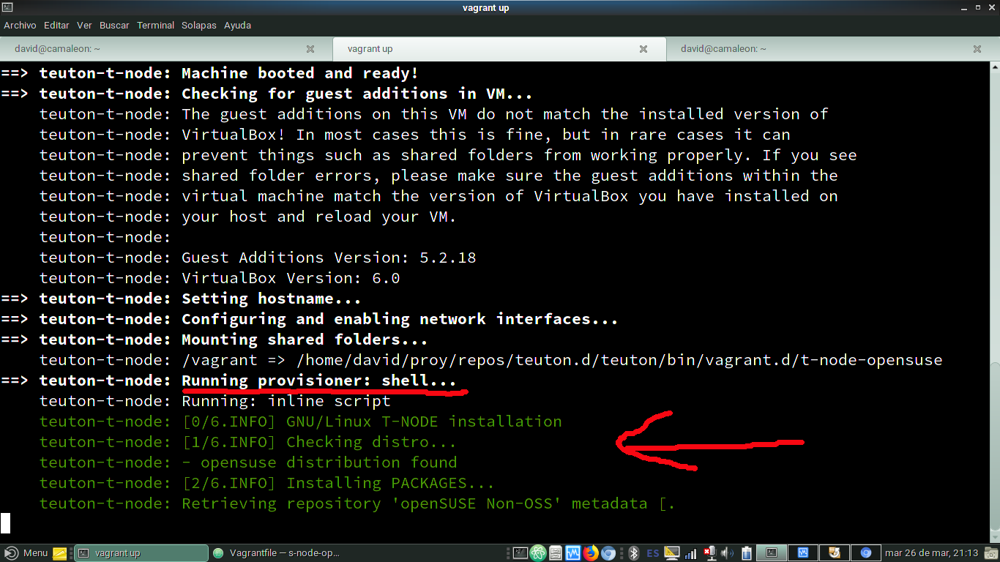
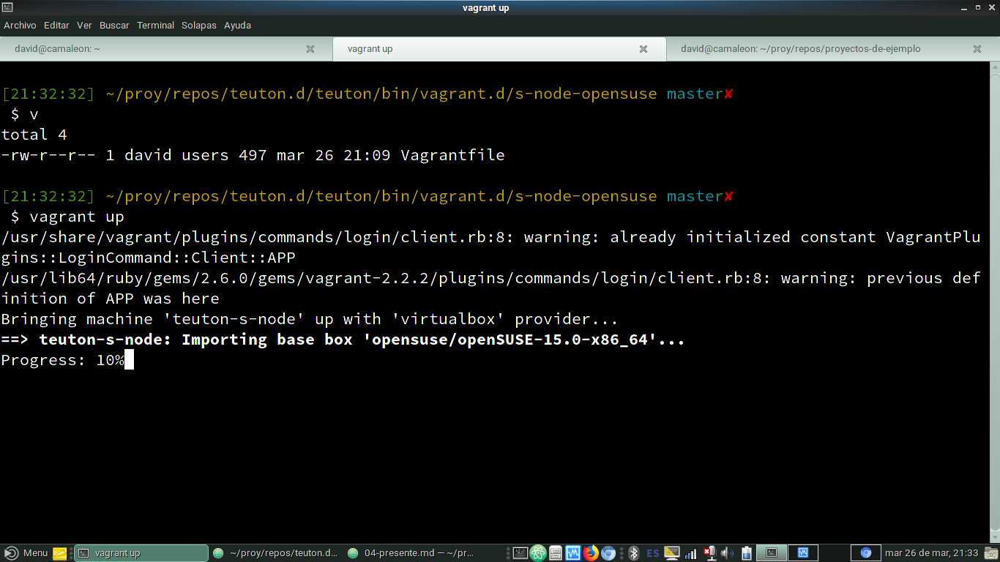
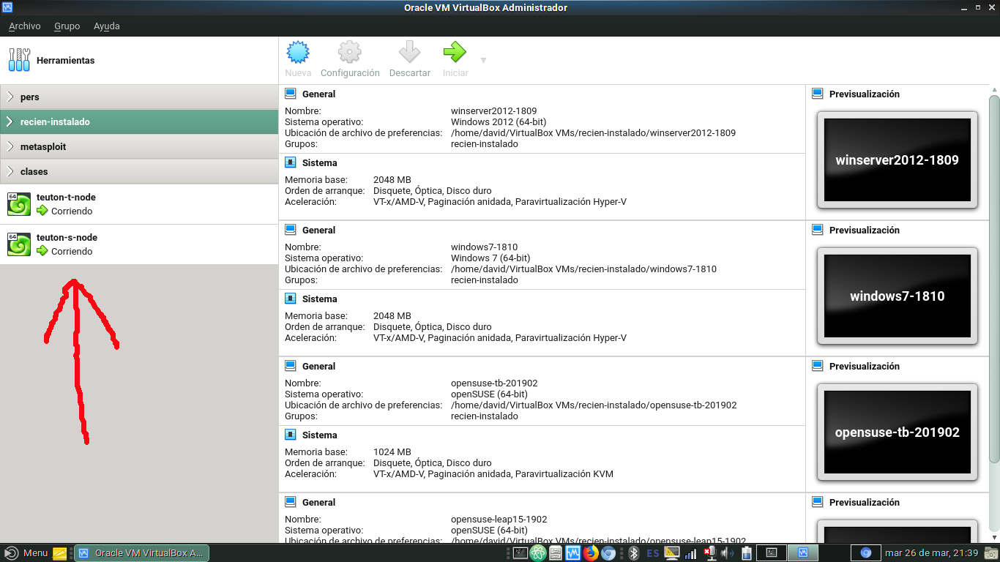

# TEUTON: Vagrant

Vagrant es una herramienta (devops) para ayudarnos con las máquinas virtuales.

---

# T-NODE

Creamos la máquina T-NODE
* Hay varias formas de instalar el software. Vamos a usar Vagrant.
* Tener instalado en local: VirtualBiox y Vagrant.
* Descargar fichero [Vagrantfile para T-NODE](./vagrant/t-node/Vagrantfile)
* `vagrant up`


```
# -*- mode: ruby -*-
# vi: set ft=ruby :

Vagrant.configure("2") do |config|
  config.vm.define "teuton-t-node" do |i|
    i.vm.box = "opensuse/openSUSE-15.0-x86_64"
    i.vm.hostname = "t-node"
    i.vm.network "public_network"

    i.vm.provision "shell", inline: <<-SHELL
    wget -qO- https://raw.githubusercontent.com/dvarrui/teuton/master/bin/linux_t-node_install.sh | bash
  SHELL
    i.vm.provider "virtualbox" do |v|
      v.name = 'teuton-t-node'
      v.memory = 2048
    end
  end
end
```










---

# S-NODE

Creamos la máquina S-NODE
* Hay varias formas de instalar el software. Vamos a usar Vagrant.
* Descargar fichero [Vagrantfile para S-NODE](./vagrant/s-node/Vagrantfile)
* `vagrant up`

```
# -*- mode: ruby -*-
# vi: set ft=ruby :

Vagrant.configure("2") do |config|
  config.vm.define "teuton-s-node" do |i|
    i.vm.box = "opensuse/openSUSE-15.0-x86_64"
    i.vm.hostname = "s-node"
    i.vm.network "public_network"
    i.vm.network :forwarded_port, guest: 80, host: 8081
    i.vm.provision "shell", inline: <<-SHELL
    wget -qO- https://raw.githubusercontent.com/dvarrui/teuton/master/bin/linux_s-node_install.sh | bash
  SHELL
    i.vm.provider "virtualbox" do |v|
      v.name = "teuton-s-node"
      v.memory = 2048
    end
  end
end
```




